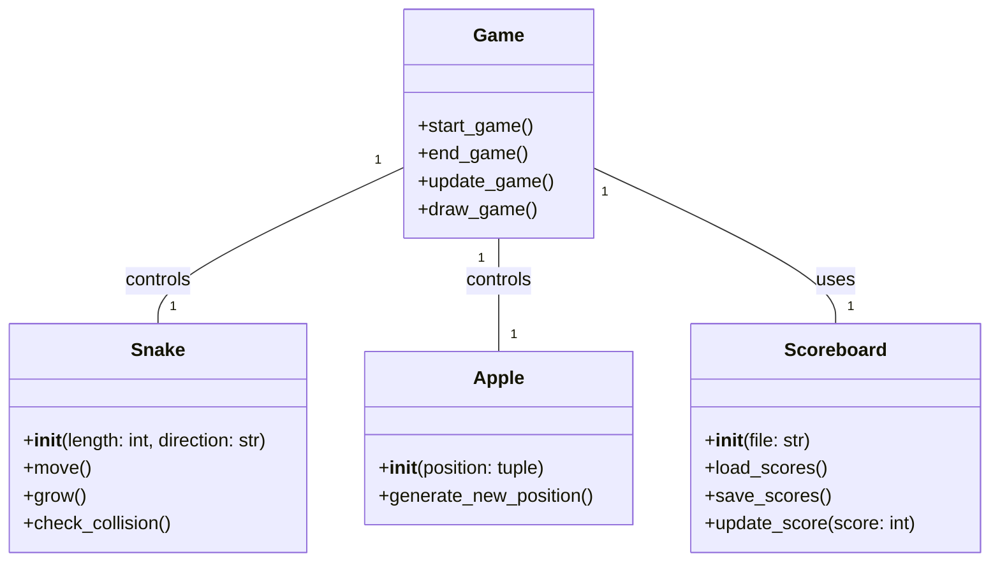
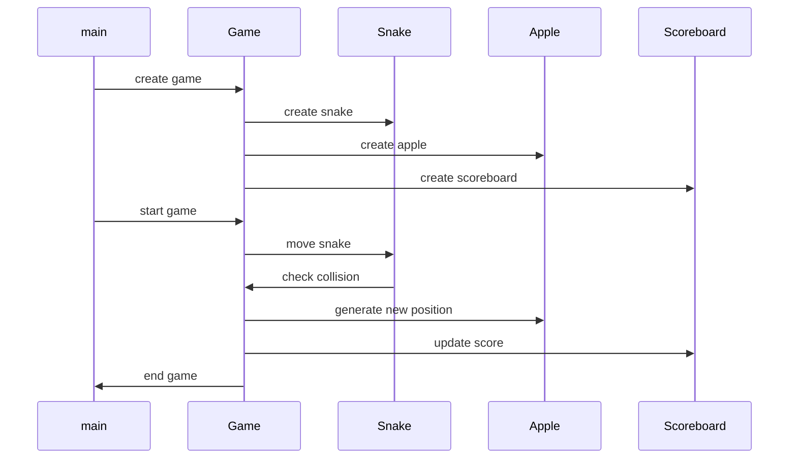

## Implementation approach
We will use the Python standard library for the core game mechanics. The `curses` library will be used to create the command-line interface, handle user input, and update the game display. The `random` library will be used to generate the position of the apple. The `time` library will be used to control the game speed. The `json` library will be used to store and load the high scores. The `argparse` library will be used to handle command-line arguments for starting a new game or viewing high scores. The `unittest` library will be used for testing. The `setuptools` library will be used to package the game for easy installation.

## Python package name
```python
"cli_snake_game"
```

## File list
```python
[
    "main.py",
    "game.py",
    "snake.py",
    "apple.py",
    "scoreboard.py",
    "tests.py",
    "setup.py"
]
```

## Data structures and interface definitions


## Program call flow


## Anything UNCLEAR
The requirement is clear to me.